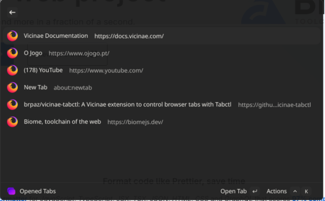

# Tabctl Vicinae

> A [Vicinae](https://github.com/vicinaehq/vicinae) extension to control your browser tabs, using [Tabctl](https://github.com/slastra/tabctl)

## Preview



## Features

- List currently open tabs in Chrome, Brave or Firefox.
- Activitate a tab (focus)
- Close a tab.

## Getting Started

## Pre Requsiites

- [NodeJS](https://nodejs.org/)
- [Vicinae](https://github.com/vicinaehq/vicinae)
- [Tabctl](https://github.com/slastra/tabctl)

Before using this extension, please ensure Tabctl is correctly installed and configured. You should be able to run `tabctl list` from the terminal and see the list of open tabs.

## Install

```
git clone https://github.com/slastra/vicinae-tabctl.git
cd vicinae-tabctl
npm install
npm run build
```

The extension should be installed in Vicinae's extension directory.

## Usage

### Extension Preferences

Before using the extension, make sure to configure the following preferences:
- **Tabctl Executable**: The path to the `tabctl` executable. You can find it by running `which tabctl` in your terminal. By default, it is set to `/usr/local/bin/tabctl`.

## Development

```bash
npm install
```

To run the extension in development mode, use:

```bash
npm run dev
```

To build the extension for production, use:

```bash
npm run build
```

## Acknowledgements

<a href="https://www.flaticon.com/free-icons/tabs" title="tabs icons">Tabs icons created by HideMaru - Flaticon</a>

<a href="https://www.flaticon.com/free-icons/mozilla" title="mozilla icons">Mozilla icons created by Freepik - Flaticon</a>

<a href="https://www.flaticon.com/free-icons/chromium" title="chromium icons">Chromium icons created by Freepik - Flaticon</a>
